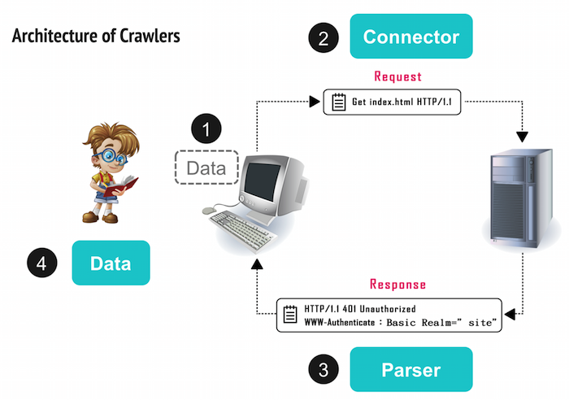

```{r setup, include=FALSE}
setwd("~/Dropbox/practice/Rcrawler")
# knitr::opts_chunk$set()
```

## 什麼是網路爬蟲（Crawler）

- 把你平常開瀏覽器查資料的步驟，寫程式讓它自動完成！

- 大數據的時代，要如何「拿到資料」是最基本的起手式。


## 爬蟲的原理：**模仿** 人類的行為

目標：找出資料放在哪裡

1. 找出資料藏在哪個 request 裡
    
2. 觀察 request 的內容
   
3. 拿取資料


## 抓資料的基本流程：觀察、觀察、再觀察


   
## 1. 找出資料藏在哪個 request 裡
練習：請用 Chrome 打開[批踢踢網頁版](https://www.ptt.cc/bbs/Gossiping/index.html)

1. 打開「開發人員工具」：右鍵 > 檢查 

2. 切換到 **Network** 標籤

3. 按下 Record network log （確認紅燈亮著）、按下 All

4. 重新整理網頁

5. 找出資料藏身在哪一個 Request 裡面


## 1. 找出資料藏在哪個 request 裡
Requests 很多，找不到怎麼辦？


* 關掉 JavaScript：Chrome extension [Quick javascript swicher](https://chrome.google.com/webstore/detail/quick-javascript-switcher/geddoclleiomckbhadiaipdggiiccfje)
    + 資料還是跑得出來：Page-Render 資料和網頁一起回來
          - ⇒找 Doc    [練習](http://db.cec.gov.tw/histQuery.jsp?voteCode=20160101T1A2&qryType=ctks)
    + 資料跑不出來：資料是用 JS Ajax 跑出來的
          - ⇒找 XHR、JS 或 WS     [練習](http://ecshweb.pchome.com.tw/search/v3.3/?q=iphone)

* 猜：望文生義 request, r, q,  ......

##  2. 觀察 request 的內容 


##  2. 觀察 request 的內容 
找到資料所在的 request 之後......

* 第一眼觀察重點：

    + Request URL

    + Request Method (GET/POST/...)

    + Status Code (200/302/404/...)

* 第二眼觀察重點：

    + Response Headers (location/set-cookie)
    
    + Request Headers (cookie/referer/user-agent/...)
    
##  2. 觀察 request 的內容 
用「無痕模式」再一次打開[批踢踢網頁版](https://www.ptt.cc/bbs/Gossiping/index.html)


##  2. 觀察 request 的內容 
轉址到 18 號窗口


##  2. 觀察 request 的內容 
點選已滿 18 歲即成功進入


##  3. 拿取資料：用瀏覽器拿取資料

適用於比較單純的網站

**複習一下：**找到資料所在的 request 之後......

* 第一眼觀察重點：

    + Request URL

    + Request Method (GET/POST/...)

    + Status Code (200/302/404/...)

## Request URL：可以修改或串接

* 通常 URL 中就有變數藏在裡面

* URL?var1=val1&var2=val2 ...

【修改 URL 變數】練習看看：

     + 2330台積電 ⇒ 2498宏達電
    
      https://tw.stock.yahoo.com/d/s/major_2330.html
    
     + 批踢踢網頁版首頁 ⇒  上一頁
    
      https://www.ptt.cc/bbs/Gossiping/index.html

## Request URL：可以修改或串接

* 通常 URL 中就有變數藏在裡面

* URL?var1=val1&var2=val2 ...

【串接 URL】練習看看

     + 5284 公車路線
   
     http://5284.taipei.gov.tw/TextSearch.aspx
  
     + 公開資訊觀測站
   
     http://mops.twse.com.tw/mops/web/t51sb01


## Request Method 

* GET (with query strings)

     + 可以直接以網址拿資料
    
     + 注意網址有時候會有參數


* POST

     + 除了提交網址之外，還要提交參數才能拿資料
    
     + 中文要注意編碼問題（特別是 Windows ） 


##  3. 拿取資料：用輔助工具拿取資料

[Advanced REST client](https://chrome.google.com/webstore/detail/advanced-rest-client/hgmloofddffdnphfgcellkdfbfbjeloo?hl=zh-TW&utm_source=chrome-ntp-launcher)

特別用在**須要通行證**的網站

* 再用[八卦板](https://www.ptt.cc/bbs/Gossiping/index.html)當例子

練習：
     
     + Mobile01 論壇
      
      http://www.mobile01.com/topiclist.php?f=520
      
     + 漫畫
     
      http://tw.ikanman.com/comic/1128/9771.html#p=3

## 拿取資料：Data Parser

要如何從 Data Page 中取出 Data？

### 用 DOM Selector (CSS/XPath)

## HTML 的樹狀結構與 DOM Selector


## HTML 的樹狀結構與 DOM Selector


## HTML 的樹狀結構與 DOM Selector


## DOM Selector： CSS Selector

安裝 Chrome extension [SelectorGadget](https://chrome.google.com/webstore/detail/selectorgadget/mhjhnkcfbdhnjickkkdbjoemdmbfginb/related?hl=zh-TW)

範例：[pchome商品](http://ecshweb.pchome.com.tw/search/v3.3/?q=apple)

Chrome Console: `document.querySelectorAll("CSS Selector")`


## DOM Selector： XPath Selector

安裝 Chrome extension [XPath Helper](https://chrome.google.com/webstore/detail/xpath-helper/hgimnogjllphhhkhlmebbmlgjoejdpjl?hl=zh-TW)

範例：[露天拍賣](http://search.ruten.com.tw/search/s000.php?enc=u&searchfrom=indexbar&k=apple&t=0)

Chrome Console: `$x("XPath Selector")`

## HOMEWORK

請安裝：

* 安裝 [RStudio](https://www.rstudio.com/products/rstudio/download3/)

* 執行 [install_packages.R](https://www.dropbox.com/s/68bs5yue0m7un2u/install_packages.R?dl=0) 以安裝所需套件

## HOMEWORK

對 R 不熟的人請閱讀：

* Quick-R：[data type](http://www.statmethods.net/input/datatypes.html)

* （中文）醫學統計與 R ：[第二章](http://web.ntpu.edu.tw/~cflin/Teach/R/R06C02DataBasic.pdf)、[第三章](http://web.ntpu.edu.tw/~cflin/Teach/R/R06EN03Object.pdf)

      + Note: 特別注意 vector, data frame, list 的使用方式

## HOMEWORK

有空的人可以：

* 玩玩 [CSS Selector](http://flukeout.github.io/)

* 玩玩 [Regular Expressions](https://regexone.com/)


