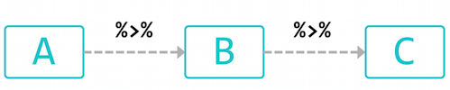

```{r setup, include=FALSE}
setwd("~/Dropbox/practice/Rcrawler")
# knitr::opts_chunk$set()
```

## 什麼是資料爬蟲（Crawler）
- 大數據的時代，要如何「拿到資料」是最基本的起手式。
- 我們不能永遠依靠「好心的市長」催促政府部門開放資料。


## 爬蟲的原理
* **模仿**人類的行為


## 抓資料的基本流程：觀察、觀察、再觀察

**目標：找出資料放在哪裡**

1. 找出資料藏在哪個 request 裡
    
2. 觀察 request 的內容
   
3. 拿取資料


   
## 1. 找出資料藏在哪個 request 裡
練習：請用 Chrome 打開[批踢踢網頁版](https://www.ptt.cc/bbs/Gossiping/index.html)

1. 打開「開發人員工具」：右鍵 > 檢查 

2. 切換到 **Network** 標籤

3. 按下 Record network log （確認紅燈亮著）、按下 All

4. 重新整理網頁

5. 找出資料藏身在哪一個 Request 裡面


## 1. 找出資料藏在哪個 request 裡
Requests 很多，找不到怎麼辦？


* 關掉 JavaScript：Chrome extension [Quick javascript swicher](https://chrome.google.com/webstore/detail/quick-javascript-switcher/geddoclleiomckbhadiaipdggiiccfje)
    + 資料還是跑得出來：Page-Render 資料和網頁一起回來
          - ⇒找 Doc    [練習](http://db.cec.gov.tw/histQuery.jsp?voteCode=20160101T1A2&qryType=ctks)
    + 資料跑不出來：資料是用 JS Ajax 跑出來的
          - ⇒找 XHR、JS 或 WS     [練習](http://ecshweb.pchome.com.tw/search/v3.3/?q=iphone)

* 猜：望文生義 request, r, q,  ......

##  2. 觀察 request 的內容 


##  2. 觀察 request 的內容 
找到資料所在的 request 之後......

* 第一眼觀察重點：

    + Request URL

    + Request Method (GET/POST/...)

    + Status Code (200/302/404/...)

* 第二眼觀察重點：

    + Response Headers (location/set-cookie)
    
    + Request Headers (cookie/referer/user-agent/...)
    
##  2. 觀察 request 的內容 
用「無痕模式」再一次打開[批踢踢網頁版](https://www.ptt.cc/bbs/Gossiping/index.html)


##  2. 觀察 request 的內容 
轉址到 18 號窗口


##  2. 觀察 request 的內容 
點選已滿 18 歲即成功進入


##  3. 拿取資料：用瀏覽器拿取資料

適用於比較單純的網站

**複習一下：**找到資料所在的 request 之後......

* 第一眼觀察重點：

    + Request URL

    + Request Method (GET/POST/...)

    + Status Code (200/302/404/...)

## Request URL：可以修改或串接

* 通常 URL 中就有變數藏在裡面

* URL?var1=val1&var2=val2 ...

【修改 URL 變數】練習看看：

     + 2330台積電 ⇒ 2498宏達電
    
      https://tw.stock.yahoo.com/d/s/major_2330.html
    
     + 批踢踢網頁版首頁 ⇒  上一頁
    
      https://www.ptt.cc/bbs/Gossiping/index.html

## Request URL：可以修改或串接

* 通常 URL 中就有變數藏在裡面

* URL?var1=val1&var2=val2 ...

【串接 URL】練習看看

     + 5284 公車路線
   
     http://5284.taipei.gov.tw/TextSearch.aspx
  
     + 公開資訊觀測站
   
     http://mops.twse.com.tw/mops/web/t51sb01


## Request Method 

* GET (with query strings)

     + 可以直接以網址拿資料
    
     + 注意網址有時候會有參數


* POST

     + 除了提交網址之外，還要提交參數才能拿資料
    
     + 中文要注意編碼問題（特別是 Windows ） 


##  3. 拿取資料：用輔助工具拿取資料

[Advanced REST client](https://chrome.google.com/webstore/detail/advanced-rest-client/hgmloofddffdnphfgcellkdfbfbjeloo?hl=zh-TW&utm_source=chrome-ntp-launcher)

特別用在**須要通行證**的網站

* 再用[八卦板](https://www.ptt.cc/bbs/Gossiping/index.html)當例子

練習：
     
     + Mobile01 論壇
      
      http://www.mobile01.com/topiclist.php?f=520
      
     + 漫畫
     
      http://tw.ikanman.com/comic/1128/9771.html#p=3


# Let’s Rock with R!

## RStudio 


## 所需套件

### Pipeline Coding

 - magrittr

### Crawler’s toolkits in R

 - rvest: a web scraper based on httr and xml2
 - httr: toolkit of HTTP methods in R
 - XML : XML parser
 - xml2: xml parser based on libxml2

### data ETL

 - stringr: string manipulaiton

 - data.table: extension of data.frame, a powerful ETL tool in R

## 安裝所需套件

```{r, eval=FALSE}
## === install required packages ===
pkg_list <- c("magrittr", "httr", "rvest", "stringr", "data.table",
              "jsonlite", "RSQLite", "devtools")
pkg_new <- pkg_list[!(pkg_list %in% installed.packages()[,"Package"])]
if(length(pkg_new)) install.packages(pkg_new)
if("xmlview" %in% pkg_new) {devtools::install_github("hrbrmstr/xmlview")}
if("data.table" %in% pkg_new) {
    install.packages("data.table", type = "source",
                      repos = "https://Rdatatable.github.io/data.table")
} else if (packageDescription("data.table")$Version < "1.9.7") {
    install.packages("data.table", type = "source",
                      repos = "https://Rdatatable.github.io/data.table")
}
rm(pkg_new, pkg_list)
```


## 好用套件介紹： [magrittr](https://cran.r-project.org/web/packages/magrittr/magrittr.pdf)


## 好用套件介紹： [magrittr](https://cran.r-project.org/web/packages/magrittr/magrittr.pdf)



- 把左手邊的參數用 **pipeline** 「 %>% 」傳送到右手邊的函式中

- Use the dot  **.**   as placeholder in a expression.

    + x %>% f is equivalent to f(x)
    
    + x %>% f(y) is equivalent to f(x, y)
  
    + x %>% f %>% g %>% h is equivalent to h(g(f(x)))

    + x %>% f(y, .) is equivalent to f(y, x)

    + x %>% f(y, z = .) is equivalent to f(y, z = x)

## 好用套件介紹： [magrittr](https://cran.r-project.org/web/packages/magrittr/magrittr.pdf)

舉例：

```{r, eval=FALSE}
a = 1:3
df = data.frame(a, b=a^2)
rownames(df) = LETTERS[1:3]
vals = lm(b ~ a, data = df)

```

pipe chain 版本

```{r}
library(magrittr)

vals = 1:3 %>% data.frame(a = ., b = .^2) %>% 
  set_rownames(LETTERS[1:3]) %>% lm(b ~ a, data = .)

```

<!-- ## 好用套件介紹： [data.table](https://cran.r-project.org/web/packages/data.table/data.table.pdf) -->

<!--  -->

<!-- - 取代內建 data.frame 的好工具 -->

<!-- - 運算效率高、節省記憶體 -->

<!-- - 資料選取方便 -->

<!-- ## 好用套件介紹： [data.table](https://cran.r-project.org/web/packages/data.table/data.table.pdf) -->

<!-- ```{r, warning=FALSE} -->
<!-- library(data.table) -->

<!-- DT = data.table(mtcars) -->
<!-- DT %<>% data.table(name = rownames(mtcars), .)  -->

<!-- ``` -->

<!-- ## 好用套件介紹： [data.table](https://cran.r-project.org/web/packages/data.table/data.table.pdf) -->

<!-- ```{r} -->
<!-- DT[cyl == 8] -->
<!-- ``` -->

<!-- ## 好用套件介紹： [data.table](https://cran.r-project.org/web/packages/data.table/data.table.pdf) -->

<!-- ```{r} -->
<!-- rr= DT[,.(Issue, Project, Date)] %>% .[,Date := factor(Date, levels=seq.date)] -->

<!-- r =  -->
<!--   rr[,.(Date=levels(Date), Count=c(table(Date))), by=.(Issue, Project)] %>% -->
<!--   .[,.(Issue, Project, Date = Date %>% as.Date, Count)] %>% -->
<!--   .[order(match(Issue, issue_table$Issue))] -->
<!-- DT %>% .[,.(gear=gl(gear))] %>% .[,.(V1 = .N, by=gear)] -->
<!-- ``` -->

## 再看一次爬蟲流程


## 再看一次爬蟲流程

**1. Data**：找出資料藏在哪個 request 裡

    + 找到資料頁，想像資料要長什麼樣子，設想產出的資料格式(schema)
    
**2. Connector**：觀察 request 的內容

    + 觀察網頁內容，找到資料所在的request/response，再一層層往上解析，套上判斷式及迴圈, 完成爬蟲的自動化
   
**3. Parser**：用 R 拿取資料

**4. Data**：解析所得資料

    + 透過正規表示式 （Regular Expression）抽取想要資料、整理資料表......

## Connection: GET Method

起手式
```{r, eval=FALSE}
library(httr)
res <- GET(
  url = "http://httpbin.org/get",
  add_headers(a = 1, b = 2),
  set_cookies(c = 1, d = 2),
  query = list(q="hihi")
)
content(res, as = "text", encoding = "UTF-8")
content(res, as = "parsed", encoding = "UTF-8")
```


