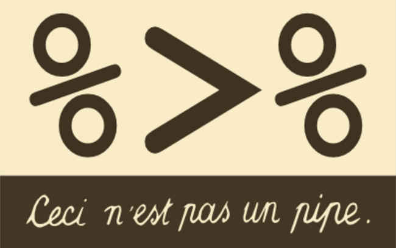
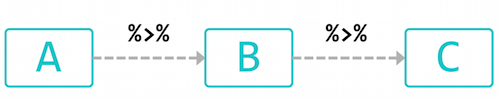
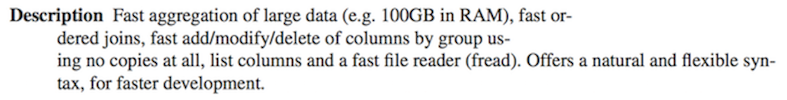
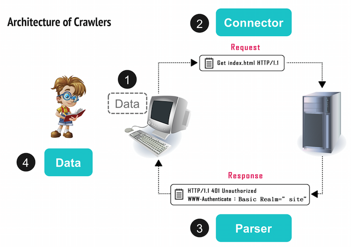

```{r setup, include=FALSE}
# knitr::opts_chunk$set(echo = FALSE)
```

# Let’s Rock with R!

## RStudio


## 所需套件

### Pipeline Coding

 - magrittr

### Crawler’s toolkits in R

 - rvest: a web scraper based on httr and xml2
 - httr: toolkit of HTTP methods in R
 - XML : XML parser
 - xml2: xml parser based on libxml2

### data ETL

 - stringr: string manipulaiton

 - data.table: extension of data.frame, a powerful ETL tool in R

## 安裝所需套件

程式碼放在 `install_packages.R`

```{r, eval=FALSE}
## === install required packages ===
pkg_list <- c("magrittr", "httr", "rvest", "stringr", "data.table",
              "jsonlite", "RSQLite", "devtools")
pkg_new <- pkg_list[!(pkg_list %in% installed.packages()[,"Package"])]
if(length(pkg_new)) install.packages(pkg_new)
if("xmlview" %in% pkg_new) {devtools::install_github("hrbrmstr/xmlview")}
if("data.table" %in% pkg_new) {
    install.packages("data.table", type = "source",
                      repos = "https://Rdatatable.github.io/data.table")
} else if (packageDescription("data.table")$Version < "1.9.7") {
    install.packages("data.table", type = "source",
                      repos = "https://Rdatatable.github.io/data.table")
}
rm(pkg_new, pkg_list)
```


## 好用套件介紹： [magrittr](https://cran.r-project.org/web/packages/magrittr/magrittr.pdf)




## 好用套件介紹： [magrittr](https://cran.r-project.org/web/packages/magrittr/magrittr.pdf)



- 把左手邊的參數用 **pipeline** 「 %>% 」傳送到右手邊的函式中

- Use the dot  **.**   as placeholder in a expression.

    + x %>% f is equivalent to f(x)

    + x %>% f(y) is equivalent to f(x, y)

    + x %>% f %>% g %>% h is equivalent to h(g(f(x)))

    + x %>% f(y, .) is equivalent to f(y, x)

    + x %>% f(y, z = .) is equivalent to f(y, z = x)

## 好用套件介紹： [magrittr](https://cran.r-project.org/web/packages/magrittr/magrittr.pdf)

舉例：

```{r, eval=FALSE}
a = 1:3
df = data.frame(a, b=a^2)
rownames(df) = LETTERS[1:3]
vals = lm(b ~ a, data = df)

```

pipe chain 版本

```{r}
library(magrittr)

vals = 1:3 %>% data.frame(a = ., b = .^2) %>%
  set_rownames(LETTERS[1:3]) %>% lm(b ~ a, data = .)

```

<!-- ## 好用套件介紹： [data.table](https://cran.r-project.org/web/packages/data.table/data.table.pdf) -->

<!--  -->

<!-- - 取代內建 data.frame 的好工具 -->

<!-- - 運算效率高、節省記憶體 -->

<!-- - 資料選取方便 -->

<!-- ## 好用套件介紹： [data.table](https://cran.r-project.org/web/packages/data.table/data.table.pdf) -->

<!-- ```{r, warning=FALSE} -->
<!-- library(data.table) -->

<!-- DT = data.table(mtcars) -->
<!-- DT %<>% data.table(name = rownames(mtcars), .)  -->

<!-- ``` -->

<!-- ## 好用套件介紹： [data.table](https://cran.r-project.org/web/packages/data.table/data.table.pdf) -->

<!-- ```{r} -->
<!-- DT[cyl == 8] -->
<!-- ``` -->

<!-- ## 好用套件介紹： [data.table](https://cran.r-project.org/web/packages/data.table/data.table.pdf) -->

<!-- ```{r} -->
<!-- rr= DT[,.(Issue, Project, Date)] %>% .[,Date := factor(Date, levels=seq.date)] -->

<!-- r =  -->
<!--   rr[,.(Date=levels(Date), Count=c(table(Date))), by=.(Issue, Project)] %>% -->
<!--   .[,.(Issue, Project, Date = Date %>% as.Date, Count)] %>% -->
<!--   .[order(match(Issue, issue_table$Issue))] -->
<!-- DT %>% .[,.(gear=gl(gear))] %>% .[,.(V1 = .N, by=gear)] -->
<!-- ``` -->

## 再看一次爬蟲流程



## 再看一次爬蟲流程

**1. Data**：找出資料藏在哪個 request 裡

    + 找到資料頁，想像資料要長什麼樣子，設想產出的資料格式(schema)

**2. Connector**：觀察 request 的內容

    + 觀察網頁內容，找到資料所在的request/response，再一層層往上解析，套上判斷式及迴圈, 完成爬蟲的自動化

**3. Parser**：用 R 拿取資料

**4. Data**：解析所得資料

    + 透過正規表示式 （Regular Expression）抽取想要資料、整理資料表......

## Connection: GET Method

起手式
```{r, eval=FALSE}
library(httr)
res <- GET(
  url = "http://httpbin.org/get",
  add_headers(a = 1, b = 2),
  set_cookies(c = 1, d = 2),
  query = list(q="hihi")
)
content(res, as = "text", encoding = "UTF-8")
content(res, as = "parsed", encoding = "UTF-8")
```

## Connection: GET Method

第一隻爬蟲：PTT Gossiping

程式碼放在 `Gossiping.R`

```{r}
library(magrittr)
library(httr)
library(rvest)

url <- "https://www.ptt.cc/bbs/Gossiping/index.html"
res <- GET(url, set_cookies(over18="1"))  # over18 cookie

## (Try get post titles)
res %>%
  content(as = "text", encoding = "UTF-8") %>%
  `Encoding<-`("UTF-8") %>%
  read_html %>%
  html_nodes(css = ".title a") %>%
  html_text()
```

## Connection: POST method

起手式

```{r}
library(httr)
library(rvest)

res <- POST(url = "http://httpbin.org/post",
            add_headers(a = 1, b = 2),
            set_cookies(c = 1, d = 2),
            body = "x=hello&y=hihi")  # raw string (need URLencode)

res <- POST(url = "http://httpbin.org/post",
            add_headers(a = 1, b = 2),
            set_cookies(c = 1, d = 2),
            body = list(x = "hello",
                        y = "hihi"), # form data as list
            encode = "form")

content(res, as = "text", encoding = "UTF-8")
content(res, as = "parsed", encoding = "UTF-8")
```

